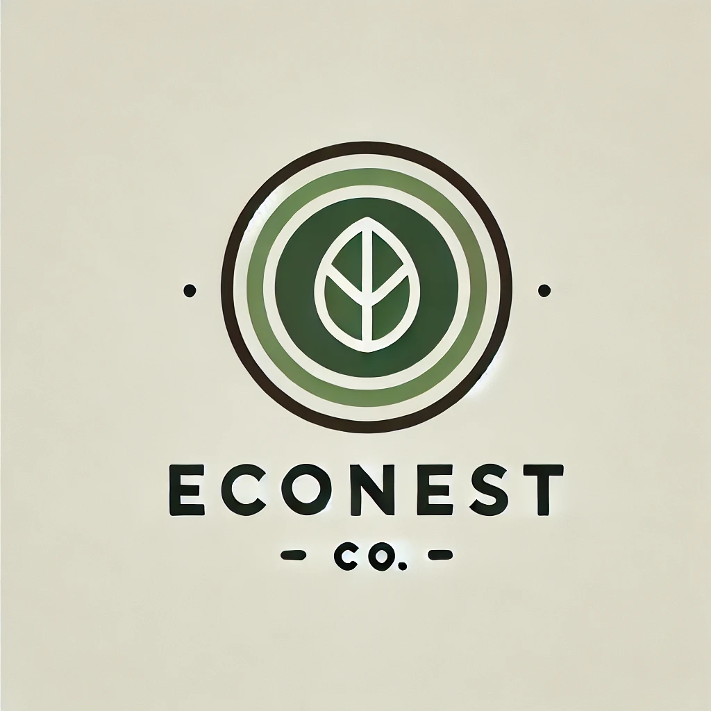

# EcoNest Customer Service Chatbot




## Overview
An AI-engineered customer service chatbot for EcoNest, demonstrating modern software architecture and natural language processing capabilities. The chatbot handles customer inquiries about products, shipping, returns, and company policies using semantic matching.

## Features
- 🤖 Intelligent query matching using fuzzy string matching
- 💬 Real-time web interface for customer interactions
- 📋 Comprehensive knowledge base integration
- 🔄 Suggestion system for similar questions
- 🎯 Accurate response mapping

## Architecture
econest-chatbot/
├── app/
│   ├── __init__.py
│   ├── main.py          # FastAPI application
│   ├── chat_logic.py    # Core chatbot logic
│   ├── models.py        # Data models
│   └── utils.py         # Utility functions
├── data/                # Knowledge base
├── static/              # Frontend assets
├── templates/           # HTML templates
└── tests/              # Test suite

## Technology Stack
- FastAPI for backend API
- Python for core logic
- Modern frontend with HTML/CSS/JavaScript
- Advanced text matching algorithms

## Setup and Installation
1. Clone repository
```bash
git clone https://github.com/ColleenShifflett/econest-chatbot.git
cd econest-chatbot
```

3. Create virtual environment
python -m venv venv
source venv/bin/activate  # On Windows: venv\Scripts\activate

4. Install dependencies
pip install -r requirements.txt

5. Run the application
uvicorn app.main:app --reload

## Roadmap
- [ ] Enhanced NLP using transformers
- [ ] RAG (Retrieval-Augmented Generation) implementation
- [ ] Multi-turn conversation support
- [ ] Analytics dashboard
- [ ] Automated testing suite
- [ ] Performance optimization

## Future Enhancements
1. AI/ML Improvements
   - Implement BERT-based embeddings
   - Add intent classification
   - Enhance semantic understanding

2. Engineering Upgrades
   - Add logging and monitoring
   - Implement caching
   - Create CI/CD pipeline

## Contributing
Contributions welcome! Please read the contributing guidelines before submitting PRs.

## License
This project is licensed under the MIT License - see LICENSE file for details.
